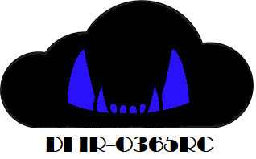

[](https://github.com/ANSSI-FR/DFIR-O365RC/actions/workflows/docker-image.yml)
---
## Table of contents:

1. [Module description](#description)
2. [Installation and pre-requisites](#install)
3. [Roles and license requirements](#roleslic)
4. [Functions included in the module](#functions)
5. [Files generated](#files)

DFIR-O365RC was presented at the SSTIC 2021 (Symposium sur la sécurité des technologies de l'information et des communications). Slides and a recording of the presentation, in french language, are available [here](https://www.sstic.org/2021/presentation/collecte_de_journaux_office_365_avec_dfir-o365rc/).

## Module description  <a name="description"></a>

The DFIR-O365RC PowerShell module is a set of functions that allow the DFIR analyst to collect logs relevant for Office 365 Business Email Compromise and Azure investigations.

The logs are generated in JSON format and retrieved from two main data sources: 

- Office 365 [Unified Audit Logs](https://docs.microsoft.com/en-us/microsoft-365/compliance/search-the-audit-log-in-security-and-compliance?view=o365-worldwide#search-the-audit-log).
- Azure AD [sign-ins logs](https://docs.microsoft.com/en-us/azure/active-directory/reports-monitoring/concept-sign-ins) and [audit logs](https://docs.microsoft.com/en-us/azure/active-directory/reports-monitoring/concept-audit-logs).

The two data sources can be queried from different endpoints:

| **Data source / Endpoint**  | **History**  | **Performance**  |  **Scope** | **Pre-requisites (OS or Azure)** |
|---|---|---|---|---|
| Unified Audit Logs / [Exchange Online PowerShell](https://docs.microsoft.com/en-us/powershell/module/exchange/search-unifiedauditlog?view=exchange-ps)  | 90 days  |  Poor | All Office 365 logs (Azure AD included)  | None | 
|  Unified Audit Logs / [Office 365 Management API](https://docs.microsoft.com/en-us/office/office-365-management-api/office-365-management-apis-overview) |  7 days |  Good |  All Office 365 logs (Azure AD included) | Azure App registration |  
|  Azure AD Logs / [Azure AD PowerShell Preview](https://docs.microsoft.com/en-us/azure/active-directory/reports-monitoring/reference-powershell-reporting) |  30 days | Good  |  Azure AD sign-ins and audit events only |  Windows OS only | 
|  Azure AD Logs / [MS Graph API](https://docs.microsoft.com/en-us/graph/api/overview?view=graph-rest-1.0) |  30 days | Good  |  Azure AD sign-ins and audit events only |  None | 


DFIR-O365RC is a forensic tool, its aim is not to monitor in real time your Office 365 infrastructure: Please use the *Office 365 Management API* if you want to analyze data in real time with a SIEM.

DFIR-O365RC will fetch data from:

- Azure AD Logs using the *MS Graph API* because performance is good, history is 30 days and it works on *PowerShell Core*.
- Unified Audit Logs using *Exchange online PowerShell* despite poor performance, history is 90 days and it works on *PowerShell Core*.

If you are investigating Exchange Online malicious activity, the Search-O365 function will also fetch the Mailbox Audit Log, using Exchange Online PowerShell.

In case you are also investigating other Azure resources (IaaS, PaaS...) DFIR-O365RC can also fetch data from Azure [Activity logs](https://docs.microsoft.com/en-us/azure/azure-monitor/essentials/activity-log) using the *[Azure Monitor RESTAPI](https://docs.microsoft.com/en-us/rest/api/monitor/)*. History is 90 days and it works on *PowerShell Core*. The Azure Activity log is primarily for activities that occur in Azure Resource Manager.

Additionally you can dump Azure [DevOps Activity logs](https://docs.microsoft.com/en-us/azure/devops/organizations/audit/azure-devops-auditing) using the *[Azure DevOps services RESTAPI](https://docs.microsoft.com/en-us/rest/api/azure/devops/audit/audit%20log/query?view=azure-devops-rest-6.1)*. History is 90 days and it works on *PowerShell Core*.

Because all functions can run on *PowerShell Core*, DFIR-O365RC works also on Linux or Mac, as long as you have have a browser in order to use device login.

## Installation and pre-requisites <a name="install"></a>

### Manual Installation.

Clone the DFIR-O365RC repository. The tool works on *PowerShell Desktop* and *PowerShell Core*. Please note that the new `Connect-ExchangeOnline` cmdlet [requires Microsoft .NET Framework 4.7.1 or later](https://learn.microsoft.com/en-us/powershell/exchange/exchange-online-powershell-v2?view=exchange-ps#windows).

DFIR-O365 uses Jason Thompson's [MSAL.PS](https://github.com/AzureAD/MSAL.PS) and Boe Prox's [PoshRSJob](https://github.com/proxb/PoshRSJob) modules as well as the [ExchangeOnlineManagement](https://www.powershellgallery.com/packages/ExchangeOnlineManagement/3.1.0) module To install them run the following commands:

```
Install-Module -Name MSAL.PS -RequiredVersion '4.37.0.0'
Install-Module -Name PoshRSJob -RequiredVersion '1.7.4.4'
Install-Module -Name ExchangeOnlineManagement -RequiredVersion '3.1.0'
```

If [MSAL.PS](https://github.com/AzureAD/MSAL.PS) module installation fails with the following message:
```
WARNING: The specified module ‘MSAL.PS’ with PowerShellGetFormatVersion ‘2.0’ is not supported by the current version of PowerShellGet. Get the latest version of the PowerShellGet module to install this module, ‘MSAL.PS’.
```

Update PowerShellGet with the following commands:
```
Install-PackageProvider Nuget -Force
Install-Module -Name PowerShellGet -Force
```

Once both modules are installed, launch a PowerShell prompt and locate your Powershell modules path with the following command:
```
PS> $env:PSModulePath
```
Copy the DFIR-O365RC directory in one of your modules path, for example on Windows:   
- *%USERPROFILE%\Documents\WindowsPowerShell\Modules*
- *%ProgramFiles%\WindowsPowerShell\Modules*
- *%SYSTEMROOT%\system32\WindowsPowerShell\v1.0\Modules*

Modules path examples on Linux:
- */home/%USERNAME%/.local/share/powershell/Modules*
- */usr/local/share/powershell/Modules*
- */opt/microsoft/powershell/7/Modules*

On PowerShell Core, the installation of the WSMan client might also be required:

```
Install-Module PSWSMan
Install-WSMan
```
The DFIR-O365RC module is installed, restart the PowerShell prompt and load the module:

```
PS> Import-module DFIR-O365RC
```

### Use Docker to run DFIR-O365RC.

Use *docker-compose* to build the image, run the container and mount a volume to retrieve logs:

```
sudo docker-compose run dfir-o365rc
```

The module is ready to use:

```
PowerShell 7.1.4
Copyright (c) Microsoft Corporation.

https://aka.ms/powershell
Type 'help' to get help.
DFIR-O365RC: PowerShell module for Office 365 and Azure log collection
https://github.com/ANSSI-FR/DFIR-O365RC
Loading personal and system profiles took 854ms.
PS /mnt/host/output>
```

## Roles and license requirements  <a name="roleslic"></a>


The user launching the tool should have the following roles:

 - Microsoft 365 role (portal.microsoft.com): **Global reader**
 - Exchange Online role (admin.exchange.microsoft.com): **View-Only Audit Logs**

In order to retrieve Azure AD [sign-ins logs](https://docs.microsoft.com/en-us/azure/active-directory/reports-monitoring/concept-sign-ins) with the *MS Graph API* you need at least one user with an [Azure AD Premium P1](https://azure.microsoft.com/en-us/pricing/details/active-directory/) license. This license can be purchased at additional cost for a single user and is sometimes included in some license plans such as the *Microsoft 365 Business Premium* for small and medium-sized businesses.

If you need to retrieve also the Azure Activity logs you need the **Log Analytics Reader** role for the Azure subscription you are dumping the logs from.

Finally if you need to collect the Azure DevOps Activity logs you need to grant the **Auditing\View audit log** permission to the user in the Azure DevOps organization you are dumping the logs from.

 ## Functions included in the module <a name="functions"></a>

The module has 9 functions:

| **Function name**  | **Data Source/History**  | **Performance**  |  **Completeness** | **Details** |
|---|---|---|---|---|
|  Get-O365Full |  Unified audit logs/90 days |  Poor |  All unified audit logs | A subset of logs per *record type* can be retrieved. Use only on a small tenant or a short period of time |
|  Get-O365Light |  Unified audit logs/90 days |  Good |  A subset of unified audit logs only | Only a subset of *operations* considered of interest is retrieved.   |
|  Get-DefenderforO365 |  Unified audit logs/90 days |  Good |  A subset of unified audit logs only | Retrieves Defender for Office 365 related logs. Requires at least an [E5 license](https://www.microsoft.com/en-us/microsoft-365/enterprise/office-365-e5?activetab=pivot:overviewtab) or a license plan such as [Microsoft Defender for Office 365 Plan](https://docs.microsoft.com/en-us/microsoft-365/security/office-365-security/office-365-atp?view=o365-worldwide#microsoft-defender-for-office-365-plan-1-and-plan-2) or [cloud app security](https://www.microsoft.com/en-us/microsoft-365/enterprise-mobility-security/cloud-app-security)  |
| Get-AADLogs  | Azure AD Logs/30 days  |  Good | All Azure AD logs  | Get tenant general information, all Azure sign-ins and audit logs. Azure AD sign-ins logs have more information than Azure AD logs retrieved via Unified audit logs. | 
| Get-AADApps  | Azure AD Logs/30 days  |  Good | A subset of Azure AD logs only  | Get Azure audit logs related to Azure applications and service principals only. The logs are enriched with application or service principal object information. | 
| Get-AADDevices  | Azure AD Logs/30 days  |  Good | A subset of Azure AD logs only  | Get Azure audit logs related to Azure AD joined or registered devices only. The logs are enriched with device object information. | 
| Search-O365  | Unified audit logs/90 days  |  Depends on the query | A subset of unified audit logs only  | Search for activity related to a particular user, IP address or use the *freetext* query. When searching **user** activity this cmdlet will also fetch the Mailbox Audit Log| 
| Get-AzRMActivityLogs  | Azure Activity logs/90 days  |  Good | All Azure Activity logs  | Get all Azure activity logs for a given subscription or on every subscription the account running the function has access to | 
| Get-AzDevOpsActivityLogs  | Azure DevOps Activity logs/90 days  |  Good | All Azure DevOps Activity logs  | Get all Azure DevOps activity logs for a given DevOps organization or on every DevOps organization the account running the function has access to | 


 When querying *Unified audit logs* you are limited to 3 concurrent *Exchange Online Powershell* sessions. DFIR-O365RC will try to use all available sessions, please close any existing session before launching the log collection.

Each function as a comment based help which you can invoke with the *get-help* cmdlet. 

```
#Display comment based help
PS> Get-help Get-O365Full
#Display comment based help with examples
PS> Get-help Get-O365Full -examples
```
Each function takes as a parameter a start date and an end date.

In order to retrieve Azure AD audit logs, sign-ins logs from the past 30 days and tenant information launch the following command:

```
$enddate = get-date
$startdate = $enddate.adddays(-30)
Get-AADLogs -startdate $startdate -enddate $enddate
```

In order to retrieve enriched Azure AD audit logs related to Azure applications and service principals from the past 30 days launch the following command:

```
$enddate = get-date
$startdate = $enddate.adddays(-30)
Get-AADApps -startdate $startdate -enddate $enddate
```

In order to retrieve enriched Azure AD audit logs related to Azure AD joined or registered devices from the past 30 days launch the following command:

```
$enddate = get-date
$startdate = $enddate.adddays(-30)
Get-AADDevices -startdate $startdate -enddate $enddate
```

In order to retrieve all unified audit logs considered of interest from the past 30 days, except those related to Azure AD, which were already retrieved by the first command, launch:

```
$enddate = get-date
$startdate = $enddate.adddays(-30)
Get-O365Light -startdate $startdate -enddate $enddate -Operationsset "AllbutAzureAD"
```

In order to retrieve all unified audit logs considered of interest in a time window between -90 days and -30 days from now launch the following command:

```
$enddate = (get-date).adddays(-30)
$startdate = (get-date).adddays(-90)
Get-O365Light -StartDate $startdate -Enddate $enddate -Operationsset All
```

If mailbox audit is enabled and you want also to retrieve *Mailboxlogin* operations you can use the dedicated switch, on large tenants beware of a 50.000 events per day limit retrieval. 

```
Get-O365Light -StartDate $startdate -Enddate $enddate -Operationsset All -MailboxLogin $true
```

If there are users with Enterprise 5 licenses or if there is a Microsoft Defender for Office 365 Plan you can retrieve Microsoft Defender related logs with the following command:

```
$enddate = get-date
$startdate = $enddate.adddays(-90)
Get-DefenderforO365 -StartDate $startdate -Enddate $enddate
```

To retrieve all Exchange Online related records from the unified audit logs between Christmas eve and Boxing day, beware that performance might be poor on a large tenant: 

```
$startdate = get-date "12/24/2020"
$enddate = get-date "12/26/2020"
Get-O365Full -StartDate $startdate -Enddate $enddate -RecordSet ExchangeOnly
```

You can use the search function to look for IP addresses, activity related to specific users or perfrom a freetext search in the unified audit logs:

```
$enddate = get-date
$startdate = $enddate.adddays(-90)
#Retrieve events using the Exchange online Powershell AppId
Search-O365 -StartDate $startdate -Enddate $enddate -FreeText "a0c73c16-a7e3-4564-9a95-2bdf47383716"

#Search for events related to the X.X.X.X and Y.Y.Y.Y IP adresses, argument is a string separated by comas.
Search-O365 -StartDate $startdate -Enddate $enddate -IPAddresses "X.X.X.X,Y.Y.Y.Y"

#Retrieve events related to users user1@contoso.com and user2@constoso.com , argument is a system.array object
Search-O365 -StartDate $startdate -Enddate $enddate -UserIds "user1@contoso.com", "user2@contoso.com"
```

When searching for specific **users**, `Search-O365` will also search in the Mailbox Audit Log. Because depending on the user's licence level and settings, audit logs might not be present in the unified audit logs.


To retrieve all Azure Activity logs the account has access to, launch the following command, available subscriptions will be displayed:
```
$enddate = get-date
$startdate = $enddate.adddays(-90)
Get-AzRMActivityLogs -StartDate $startdate -Enddate $enddate
```

To retrieve all Azure DevOps Activity logs the account has access to, launch the following command, available Azure DevOps organizations will be displayed:
```
$enddate = get-date
$startdate = $enddate.adddays(-90)
Get-AzDevOpsActivityLogs -StartDate $startdate -Enddate $enddate
```
When using *PowerShell Core* the authentication process will require a *device code*, you will need to use the *devicecode* parameter and launch your browser, open the *https://microsoft.com/devicelogin* URL and enter the code provided by the following message:
  
  ```
  PS> Get-O365Light -StartDate $startdate -Enddate $enddate -DeviceCode:$true
  To sign in, use a web browser to open the page https://microsoft.com/devicelogin and enter the code XXXXXXXX to authenticate.
  ```
  
 ## Files generated <a name="files"></a>

All files generated are in JSON format.

- Get-AADApps creates a file named *AADApps_%FQDN%.json* in the *azure_ad_apps* folder where *FQDN* is the domain name part of the account used to collect the logs. 
- Get-AADDevices creates a file named *AADDevices_%FQDN%.json* in the *azure_ad_devices* folder. 
- Get-AADLogs creates folders named after the current date using the *YYYY-MM-DD* format in the *azure_ad_signin* folder, in each directory a file called *AADSigninLog_%FQDN%_YYYY-MM-DD_HH-00-00.json* is created for Azure AD sign-ins logs. A folder *azure_ad_audit* is also created and results are dumped in files named *AADAuditLog_%FQDN%_YYYY-MM-DD.json* for Azure AD audit logs. Finally a folder called *azure_ad_tenant* is created and the general tenant information written in a file named *AADTenant_%FQDN%.json*.
- Get-AzRMActivityLogs creates folders named after the current date using the *YYYY-MM-DD* format in the *azure_rm_activity* folder, in each directory a file called *AzRM_%FQDN%_%SubscriptionID%_YYYY-MM-DD_HH-00-00.json* is created where %SubscriptionID% is the Azure subscription ID. A folder called *azure_rm_subscriptions* is created and each subscription information written in a file named *AzRMsubscriptions_%FQDN%.json*.
- Get-AzDevOpsActivityLogs creates folders named after the current date using the *YYYY-MM-DD* format in the *azure_DevOps_activity* folder, in each directory a file called *AzDevOps_%FQDN%_%DevOpsOrganizationname%_YYYY-MM-DD_HH-00-00.json* is created where %DevOpsOrganizationname% is the Azure DevOps organization name. A folder called *azure_DevOps_orgs* is created and each azure DevOps organization information written in a file named *AzdevopsOrgs_%FQDN%.json.
- Get-O365Full creates folders named after the current date using the *YYYY-MM-DD* format in the *O365_unified_audit_logs*, in each directory a file called *UnifiedAuditLog_%FQDN%_YYYY-MM-DD_HH-00-00.json* is created.
- Get-O365Light creates folders named after the current date using the *YYYY-MM-DD* format in the *O365_unified_audit_logs*, in each directory a file called *UnifiedAuditLog_%FQDN%_YYYY-MM-DD.json* is created.
- Get-DefenderforO365 creates folders named after the current date using the *YYYY-MM-DD* format in the *O365_unified_audit_logs*, in each directory a file called *UnifiedAuditLog_%FQDN%_YYYY-MM-DD_DefenderforO365.json* is created.
- Search-O365 creates folders named after the current date using the *YYYY-MM-DD* format in the *O365_unified_audit_logs*, in each directory a file called *UnifiedAuditLog_%FQDN%_YYYY-MM-DD_%searchtype%.json* is created, where *searchtype* can have the values "*Freetext*", "*IPAddresses*" or "*UserIds*". *MailboxAuditLog_%FQDN%_YYYY-MM-DD_UserIds.json* files can also be created when investigating activity from users.

Launching the various functions will generate a similar directory structure:

```
DFIR-O365_Logs
│   Get-AADApps.log
│   Get-AADDevices.log
│   Get-AADLogs.log
|   Get-AzRMActivityLogs
│   Get-DefenderforO365.log
│   Get-O365Light.log    
│   Search-O365.log
└───azure_ad_apps
│    │   AADApps_%FQDN%.json
└───azure_ad_audit
│    │   AADAuditLog_%FQDN%_YYYY-MM-DD.json
│    │   ...
└───azure_ad_devices
│    │   AADDevices_%FQDN%.json 
└───azure_ad_signin
│   │
│   └───YYYY-MM-DD
│       │   AADSigninLog_%FQDN%_YYYY-MM-DD_HH-00-00.json
│       │   ...
└───azure_ad_tenant
│    │   AADTenant_%FQDN%.json
└───azure_rm_activity
│   │
│   └───YYYY-MM-DD
│       │   AzRM_%FQDN%_%SubscriptionID%_YYYY-MM-DD_HH-00-00.json
│       │   ...
└───azure_rm_subscriptions
│    │   AzRMsubscriptions_%FQDN%.json
└───azure_DevOps_activity
│   │
│   └───YYYY-MM-DD
│       │   AzDevOps_%FQDN%_%DevOpsOrganisationname%_YYYY-MM-DD_HH-00-00.json
│       │   ...
└───azure_DevOps_orgs
│    │   AzdevopsOrgs_%FQDN%.json
└───O365_unified_audit_logs
│   │
│   └───YYYY-MM-DD
│       │   UnifiedAuditLog_%FDQN%_YYYY-MM-DD.json
│       │   UnifiedAuditLog_%FQDN%_YYYY-MM-DD_freetext.json
│       │   MailboxAuditLog_%FQDN%_YYYY-MM-DD_UserIds.json
│       │   UnifiedAuditLog_%FQDN%_YYYY-MM-DD_DefenderforO365.json
│       │   UnifiedAuditLog_%FQDN%_YYYY-MM-DD_HH-00-00.json
│       │   ...

```
